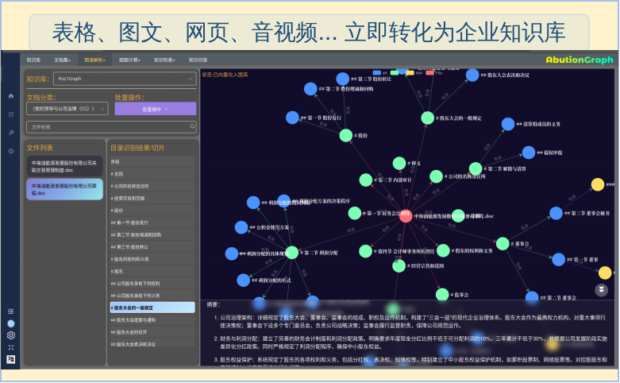

# KnowLion：基于动态图数据库的动态超图知识检索系统（更新中）

[](https://opensource.org/licenses/MIT)
[](https://www.python.org/downloads/)

## 重新定义企业知识检索

在企业级检索增强生成（RAG）领域，传统方案普遍面临"知识割裂（向量库与静态图谱分离）、更新滞后（人工定时维护）、召回不全（仅1-2路检索）、可解释性弱（无推理路径）"四大核心痛点，难以支撑动态演化的业务知识管理需求。

KnowLion作为**首款基于动态图数据库（AbutionGraph）实现的企业级智能 HyperGraphRAG 系统**，通过"动态知识建模+多维度检索融合+实时知识聚合"三大核心能力，构建"Doc→Para→Entity"三级超图一体化存储，实现从"功能性信息检索"到"越用越聪明的动态知识管理"的跨越。

### 核心亮点
- ✅ **五重检索内核**：融合Vector语义、BM25关键词、Graph动态推理、上下文关联、实体多跳推理，覆盖"模糊查询-精准术语-跨文档关联-深层推理"全场景；
- ✅ **全属性实时演化**：实体频次、实时语义聚合、邻居基数等属性通过动态聚合函数自动更新，无需人工干预，新文档入库即可检索；
- ✅ **智能自维护机制**：段落主题重叠率≥80%时触发VectorSimCrudAgent，调用LLM自动合并相似知识、更新冲突关系，维护成本降低80%；
- ✅ **轻量化超图架构**：跨文档多对多轻量级聚合边设计（仅存"事实+频次"），避免传统图谱存储冗余，多跳推理速度提升50%。

## 系统架构

### 全链路闭环设计
KnowLion采用"知识生产-存储-检索-维护-问答"一体化全链路闭环设计架构，覆盖非结构化数据解析、知识存储架构、知识自驱更新、知识检索召回设计、精准答案生成等全RAG环节的闭环，解决传统RAG"数据割裂、检索单一"问题。

### 核心技术栈

| 技术层 | 核心组件 | 功能作用 |
|--------|----------|----------|
| 文档解析层 | OCR小模型 + 多模态大模型 | 识别多格式内容，图片/表格/公式转结构化文本 |
| 知识处理层 | EmbeddingModel + LLM | 语义向量化、实体关系抽取、质量评分 |
| 存储层 | AbutionGraph动态图数据库 | 动态属性聚合、实时索引、实时图计算 |
| 检索层 | 五路召回引擎 + RRF排序 | 全场景检索、公平融合 |
| 维护层 | Agent智能组件 | 相似知识子图合并、自动更新 |

## 三级超图存储结构设计
> 特别说明：在KnowLion-1.0版本中，保留完整的文档目录结构进行超图构建，介于维护成本和检索的复杂性，不一定能得到更优的结果，在此2.0版本中采用了更适合的摘要主题结构进行向量图谱的超图构建。


### 创新存储架构
KnowLion摒弃传统"向量库+静态图谱"分离模式，以"检索为中心"设计Schema，构建"Doc→Para→Entity"三级超图，实现"语义特征、实体关系、动态属性"一体化存储。利用时序聚合计算能力实现实时演化，数据写入立即可进行多粒度检索互筛，无需二次加工。

| 实体层级 | 核心属性（动态聚合能力） | 聚合方式/更新逻辑 | 核心作用 |
|----------|------------------------|-------------------|----------|
| 文档（Doc） | 1. vector：文档级聚合向量<br>2. doc_bm25：实体词频/逆文档频率<br>3. updated_at：最新更新时间<br>4. classify：子图隔离标签 | 1. VectorIndexMerge()<br>2. BM25Index()<br>3. Agg.Max()<br>4. Agg.StrConcat("\|") | 粗粒度索引，快速筛选相关文档 |
| 段落（Para） | 1. content：动态融合内容<br>2. entity_count：实体密度<br>3. vector：段落语义向量<br>4. 主题重叠率：触发Agent更新 | 1. Agg.StrConcat("\n")<br>2. Agg.Sum()<br>3. Agg.FloatArrayAdd()<br>4. 实时计算 | 细粒度检索单元，直接作为答案来源 |
| 实体（Entity） | 1. synonyms：同义词集合<br>2. occur_count：出现频次<br>3. confidence/importance：置信度/重要性<br>4. neighbors：邻居基数<br>5. vector：聚合向量 | 1. Agg.CollectionConcat()<br>2. Agg.Sum()<br>3. Agg.QuantileDoubles()<br>4. Agg.DistinctCountHllp()<br>5. Agg.FloatArrayAdd() | 知识关联核心，支撑跨文档/多跳检索 |

## 动态图谱核心技术

### 动态图谱创新特性
传统RAG图谱多为"静态构建+定期更新"，KnowLion的核心是**动态属性驱动的超图模型**。通过8大动态特性实现知识"自生长、自优化"：

| 动态特性 | AbutionGraph内置实现 | 业务价值 |
|----------|---------------------|----------|
| 时序驱动演化 | `updated_at(Agg.Max())`+`occur_count(Agg.Sum())` | 高频实体优先展示，旧知识自动降权 |
| 实时向量聚合 | `vector(Agg.FloatArrayAdd())` | 新文档立即内可检索，检索精度不衰减 |
| 动态邻居发现 | `neighbors(Agg.DistinctCountHllp())` | 识别核心实体（如高频关联的"GC03项目"） |
| 质量动态评估 | `confidence(Agg.QuantileDoubles())` | 业务新词自动标记，支撑NLP模型对查询文本的识别 |
| 关系事实演进 | `fact(Agg.CollectionConcat())` | 保留关系全量历史，避免描述丢失 |
| 权限动态继承 | `classify(Agg.RoleConcat())` | 新实体/段落自动继承权限，适配多租户 |
| 实时索引更新 | Vector/BM25索引增量更新 | 知识更新无感知，响应速度稳定 |
| Agent自动维护 | 重叠率阈值触发`Agg.VectorSimCrudAgent(monitor)` | 使用LLM自动更新局部区域子图，减少人工成本，降低知识冗余 |

## 多路检索架构设计

### 整体检索流程
```
用户问题 → 多路并行召回 → RRF重排序 → 上下文压缩 → 生成答案
    ↓           ↓              ↓           ↓         ↓
  查询理解  向量/关键词/关联/  融合排序  信息精炼  可解释答案
           上下文/推理召回
```

### 全场景五路召回策略
| 召回路径 | 技术原理 | 优化策略 | 适用场景 |
|----------|----------|----------|----------|
| 1. Vector语义召回 | 基于语义向量计算余弦相似度 | 文档粗筛→段落精筛，效率提升10倍 | 模糊查询（如"如何优化检索速度"） |
| 2. BM25关键词召回 | 实体词典优化分词，统计词频/逆文档频率 | 双输出：文档段落+命中实体，精准匹配术语 | 技术术语（如"API参数配置"） |
| 3. 实体关联召回 | 以种子实体为桥梁，串联跨文档段落 | 实体质量分=相似度×重要性×中心性×跨文档奖励 | 跨部门知识关联（如"项目进度"） |
| 4. 上下文关联召回 | 基于Para2Para边，召回相邻段落 | 实体密度≥5的段落得分+20%，优先高信息密度 | 步骤类查询（如"部署流程"） |
| 5. 多跳推理召回 | 2-3跳路径遍历，路径得分剪枝 | 得分公式：0.4语义+0.3路径+0.2重要性+0.1多样性 | 深层关联（如"项目供应链风险"） |

## 安装

### 一、安装AbutionGraph动态图数据库
1）登录阿里云容器镜像服务<br>
sudo docker login --username=[填写你的阿里云账号] registry.cn-hangzhou.aliyuncs.com

2）从阿里云拉取<br>
sudo docker pull registry.cn-hangzhou.aliyuncs.com/thutmose/docker:3.5.0

3）运行容器<br>
sudo docker run -d --name abution-graph-db -p 9995:9995 abution-graph:3.5.0

4）打开监控页面<br>
http://localhost:9995/

## 二、下载模型依赖
OCR模型下载：https://www.modelscope.cn/AbutionGraph/abution_graph_db_install_package

### 三、安装KnowLion
```bash
pip install abutionpy-3.2.0-py2.py3-none-any.whl（模型下载地址中可获取）
pip install knowlion-0.2.0-py3-none-any.whl （项目内可获取）

安装doc转pdf工具（可选）
pip install python-docx
sudo add-apt-repository ppa:libreoffice/ppa
sudo apt update
sudo apt install libreoffice
sudo apt install unoconv
```

## 快速开始

```python
from knowlion.abution_knowlion_driver import KnowLion

MODEL_CONFIGS = {
    # 文本模型（仅处理文字对话）
    "text": {
        "model_name": "openai/qwen-max",
        "api_base": "https://dashscope.aliyuncs.com/compatible-mode/v1",
        "api_key": "sk-09a998..."
    },
    # 多模态模型（处理文本+图片）
    "visual": {
        "model_name": "openai/qwen-vl-plus",
        "api_base": "https://dashscope.aliyuncs.com/compatible-mode/v1",
        "api_key": "sk-09a998..."
    },
    # 向量模型（生成文本嵌入向量）
    "embed": {
        "model_name": "openai/text-embedding-v4",
        "api_base": "https://dashscope.aliyuncs.com/compatible-mode/v1",
        "api_key": "sk-09a998..."
    }
}
# OCR本地模型路径
model_path = "/thutmose/app/abution/model"

# 初始化 KnowLion 实例
knowlion = KnowLion(MODEL_CONFIGS, graph_name="my_graph")

# 初始化图数据库
knowlion.init_graph()

# 将文档转换为知识并存储（分步骤进行）
file_path = "/media/dataset/pdfs/"
md_content = knowlion.convert_to_markdown(model_path, file_path)
triples = knowlion.markdown_to_triple(md_content)
knowledge = knowlion.triple_to_knowledge(triples)
knowlion.knowledge_to_save(knowledge)

# 检索知识
results = knowlion.search("查询内容", top_k=5)
```

## 作者


## 未来
我们将在项目中持续更新，并在不久后增加基于动态图数据库构建的 AI-Memory（Mindori）平行系统。

## 贡献

支持项目收购以更好的推广，欢迎提交 Issue 和 Pull Request 来帮助改进 KnowLion 项目！
