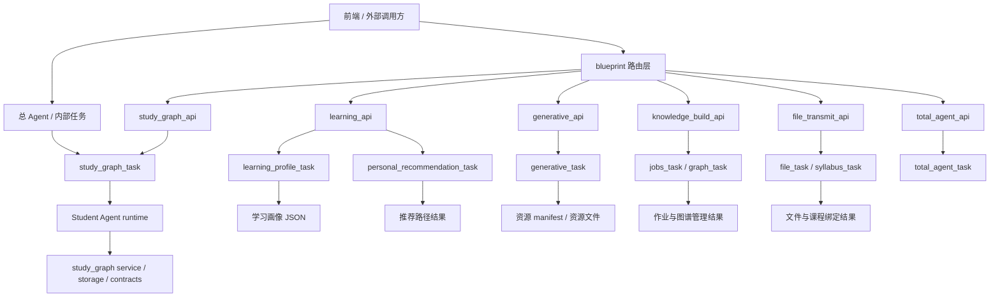

# 接口调用总览文档

本文档用于把当前后端的接口调用关系统一收口，避免把“小计划 / 收口计划 / 执行 / 关闭报告”这几层内容混在一起。重点只回答四件事：哪些是对外 HTTP 入口，哪些是 task 门户，四个核心模块分别怎么调用，以及 4 个 agent 产物应该展示什么。

## 1. 总体分层

当前后端可以按三层理解：

```text
前端 / 外部调用方
  -> blueprint HTTP 接口
    -> tasks.*_task 门户
      -> 包内 agent / service / storage / contracts
        -> JSON / 文件 / manifest / tree / 图结构结果
```

四个核心业务模块如下：

1. 学习画像模块：生成用户画像、学习状态、个人大纲初始化与详情读取。
2. 学习路径推荐模块：基于画像和课程大纲生成推荐路径。
3. 资源生成模块：生成 documents / mindmap / quiz / coding_practice / ppt 等资源。
4. 学习成长树模块：把学生事件、资源事件和 RAG 上下文沉淀到学习树。
5. 总 Agent 模块：统一调度画像、推荐、资源生成和学习成长树，是跨模块编排入口，不直接产出教学内容。

其中，`knowledge_build_api` 和 `file_transmit_api` 属于支撑链路，不是 4 个 agent 产物的主展示面。

## 2. 调用关系总图

先看总链路，后看每个模块。



调用关系可以按“外部入口 -> 路由层 -> task 门户 -> 包内实现 -> 返回结果”来理解。前端不应该直接跳过 blueprint 去碰 `tasks.*` 包内实现，`study_graph_task` 这种任务层入口则主要供总 Agent 和内部编排调用。

调用矩阵：

| 调用方 | 被调用者 | 触发时机 | 返回结果 |
|---|---|---|---|
| 前端 / API 客户端 | `blueprint.learning_api` | 用户查看画像、初始化个人大纲、发起路径推荐 | 画像、个人大纲、推荐路径 |
| 前端 / API 客户端 | `blueprint.generative_api` | 用户生成或查看资源 | 资源列表、资源详情、资源文件 |
| 前端 / API 客户端 | `blueprint.knowledge_build_api` | 用户创建图谱、创建作业、查看作业状态 | job、graph 管理信息 |
| 前端 / API 客户端 | `blueprint.file_transmit_api` | 用户上传文件或查看下载 | file、syllabus 绑定信息 |
| 前端 / API 客户端 | `blueprint.study_graph_api` | 查看学习树、查看特征、触发 Student Agent 更新 | 学习树、特征、变更轨迹 |
| 前端 / API 客户端 | `blueprint.total_agent_api` | 统一调度学习画像、推荐、资源生成和学习树 | Total Agent 结果、tool_trace、状态事件 |
| 总 Agent / 内部任务 | `tasks.study_graph_task` | 学生事件、资源事件、RAG 结果需要沉淀到学习树 | 学习树、特征、变更轨迹 |
| 总 Agent / 内部任务 | `tasks.total_agent_task` | 统一路由学习画像、推荐、资源生成和学习树 | Total Agent 统一结果 |
| `learning_api` | `learning_profile_task` | 画像构建、个人大纲读取与初始化 | profile、personal_syllabus |
| `learning_api` | `run_recommendation_route_from_payload` | 需要生成学习路径推荐 | 推荐图、候选路径、选中路径 |
| `generative_api` | `generative_task` | 需要批量或单条资源生成 | 资源 manifest、资源详情 |
| `knowledge_build_api` | `jobs_task` / `graph_task` | 需要管理图谱构建作业 | job、graph 管理结果 |
| `file_transmit_api` | `file_task` / `syllabus_task` | 文件进入系统并绑定课程 | file、syllabus 记录 |

## 3. 模块与接口对应关系

| 模块 | HTTP 入口 | task 门户 | 主要输出 |
|---|---|---|---|
| 学习画像 | `/api/learning_profile_detail`、`/api/learning_profile_refresh`、`/api/learning_init_personal_syllabus`、`/api/learning_personal_syllabus_detail` | `tasks.learning_profile_task` | `profile`、`personal_syllabus`、画像特征、建议记录 |
| 学习路径推荐 | `/api/personal_recommendation` | `tasks.personal_recommendation_task` | `graph`、`candidates`、`selected`、`best_path` |
| 资源生成 | `/api/generative_generate`、`/api/generative_list`、`/api/generative_detail` | `tasks.generative_task` | 资源 manifest、资源详情、渲染文件 |
| 学习成长树 | `/api/study_graph/detail`、`/api/study_graph/features`、`/api/study_graph/agent_run` | `tasks.study_graph_task` | `tree`、`features`、`changes`、`tool_trace` |
| 总 Agent | `/api/total_agent/detail`、`/api/total_agent/run`、`/api/total_agent/agent_run` | `tasks.total_agent_task` | `result`、`tool_trace`、`tool_status_events`、`suggested_next_action` |
| 支撑作业 / 文件 | `/api/job_*`、`/api/file_*` | `tasks.jobs_task`、`tasks.file_task`、`tasks.syllabus_task`、`tasks.graph_task` | job、file、graph、syllabus 记录 |

## 4. 4 个模块的调用链

### 4.1 学习画像模块

外部接口：

- `POST /api/learning_profile_detail`：只读持久化画像，不触发画像 Agent。
- `POST /api/learning_profile_refresh`：显式构建或刷新画像。
- `POST /api/learning_init_personal_syllabus`
- `POST /api/learning_personal_syllabus_detail`

调用链：

```text
API / task 请求
  -> learning_profile_task
    -> get_persisted_learning_profile / build_learning_profile
    -> read_profile_personal_syllabus / init_profile_personal_syllabus
    -> 画像 agent / service / storage
    -> profile + personal syllabus + feature bundle
```

适合前端展示的内容：

- 画像总分、掌握度等级、薄弱点、已掌握点。
- 个人大纲的当前状态与初始化结果。
- 画像建议历史和变化轨迹。

### 4.2 学习路径推荐模块

外部接口：

- `POST /api/personal_recommendation`

调用链：

```text
API 请求
  -> run_recommendation_route_from_payload
    -> run_recommendation_route
    -> build_recommendation_profile
    -> load_recommendation_learning_tree
    -> candidate generation / pruning / scoring / selection
    -> 返回推荐路径结果
```

适合前端展示的内容：

- 推荐图 `graph`。
- 候选路径 `candidates`。
- 选中路径 `selected`。
- 默认高亮路径 `best_path`。

### 4.3 资源生成模块

外部接口：

- `POST /api/generative_generate`
- `POST /api/generative_list`
- `POST /api/generative_detail`

调用链：

```text
API 请求
  -> generative_task.run_resource_generation_agent
    -> normalize_generation_request
    -> resource planning agent
    -> resource generation agent
    -> persist_generated_resource
    -> manifest / resource json / markdown / mermaid / pptx
```

适合前端展示的内容：

- 生成成功/失败统计。
- 资源列表与单资源详情。
- 资源正文 JSON 与可渲染文件。
- 生成时间、类型、主题、校验结果。

### 4.4 学习成长树模块

外部接口：

- `GET /api/study_graph/detail`
- `GET /api/study_graph/features`
- `POST /api/study_graph/agent_run`

任务层入口：

- `run_student_agent(payload)`
- `get_student_learning_graph(user_id, syllabus_id, include_debug=False)`
- `build_study_graph_changes_from_student_payload(payload)`
- `build_study_graph_changes_from_resource_event(payload)`
- `submit_learning_tree_changes(...)`

调用链：

```text
外部总 Agent / 内部任务请求
  -> study_graph_task.run_student_agent
    -> Student Agent runtime
    -> rag_search / get_tree_context
    -> build_study_graph_changes_from_student_payload
    -> submit_learning_tree_changes
    -> get_student_learning_tree
    -> get_learning_tree_features
    -> 返回 tree + features + changes + tool_trace
```

适合前端展示的内容：

- 学习树节点和边。
- 节点掌握度、成长状态、薄弱节点。
- 本次变更列表 `changes`。
- 运行过程轨迹 `tool_trace`。

### 4.5 总 Agent 模块

外部接口：

- `GET /api/total_agent/detail`
- `POST /api/total_agent/run`
- `POST /api/total_agent/agent_run`

调用链：

```text
API 请求
  -> total_agent_task.run_total_agent / run_total_agent_agent
    -> load_total_context
    -> infer_user_intent
    -> route to learning_profile_task / personal_recommendation_task / generative_task / study_graph_task
    -> 返回 TotalAgentResult + tool_trace + tool_status_events + suggested_next_action
```

适合前端展示的内容：

- `intent` 与 `suggested_next_action`。
- `tool_trace` 与 `tool_status_events`。
- 统一的 `result`，其中可按意图读取画像、推荐、资源或答疑结果。

## 5. 支撑接口的定位

### 5.1 `knowledge_build_api`

这个蓝图主要负责作业和图谱构建的管理，不是 4 个 agent 产物的主展示面。

核心接口：

- `POST /api/job_graph_create`
- `GET /api/job_graph_list`
- `POST /api/job_create`
- `POST /api/job_pause`
- `POST /api/job_resume`
- `POST /api/job_end`
- `POST /api/job_detail`
- `GET /api/job_list`

适合展示的内容：

- 图谱创建结果。
- 构建 job 的状态、详情、暂停、恢复、结束。
- 文件进入图谱构建流水线的管理信息。

### 5.2 `file_transmit_api`

这个蓝图主要负责文件上传、列表和下载，是知识构建和课程材料的前置支撑。

核心接口：

- `POST /api/file_upload`
- `POST /api/file_upload_calendar`
- `POST /api/file_list_graph_files`
- `POST /api/file_list_syllabus_files`
- `POST /api/file_detail`
- `GET /api/file_download`

适合展示的内容：

- 文件上传结果。
- 文件与图谱 / 课程的绑定关系。
- 文件详情和下载链接。

## 6. 四个 agent 产物应该展示什么

### 6.1 学习画像产物

推荐展示字段：

- 用户 ID、课程 ID。
- `overall_level`、`overall_score`、`syllabus_score`、`answer_score`、`engagement_score`。
- `weak_points`、`mastered_points`、`concept_gaps`。
- 个人大纲是否已初始化。

### 6.2 学习路径推荐产物

推荐展示字段：

- `graph.nodes`、`graph.edges`。
- `candidates[].path`、`candidates[].scores`。
- `selected[]`。
- `best_path`。

### 6.3 资源生成产物

推荐展示字段：

- `resource_id`、`resource_type`、`title`、`topic`、`status`。
- `resource_dir`。
- `main_files`、`validation`。
- `content`、`render`。

### 6.4 学习成长树产物

推荐展示字段：

- `tree.tree_id`、`tree.title`、`tree.virtual_root`。
- `tree.nodes`、`tree.edges`、`tree.summary`。
- `features.learned_topics`、`weak_topics`、`mastered_topics`、`tree_growth`。
- `changes`、`tool_trace`。

## 7. 推荐调用顺序

如果你要在一个完整业务流程里串起来，推荐按下面的顺序理解：

```text
1. 文件上传 / 图谱作业准备
2. 学习画像构建
3. 学习路径推荐
4. 资源生成
5. 学习成长树沉淀
```

这不是强制顺序，但它最符合当前工程里的职责分工：先有数据和上下文，再做推荐和生成，最后把学生行为沉到学习树里。

## 8. 需要避免的混淆

- 不要把 `knowledge_build_api` 当成 agent 产品接口，它是作业与图谱构建管理接口。
- 不要把 `file_transmit_api` 当成资源生成接口，它只负责文件进入系统。
- `total_agent_api` 是跨模块编排入口，不直接替代具体的画像、推荐、资源或学习树蓝图。
- `learning_ask_question` 和 `learning_update_personal_syllabus` 已经是 deprecated 路由，不应作为新链路入口。
- 学习成长树当前主要通过任务层入口调用，不要凭空写成不存在的 HTTP 蓝图。

## 9. 一句话总结

当前后端的接口调用主链路可以概括为：

```text
文件/课程上下文 -> 学习画像 -> 学习路径推荐 -> 资源生成 -> 学习成长树
```

如果前端要展示 4 个 agent 产物，就分别展示：画像、推荐路径、生成资源、学习树。
