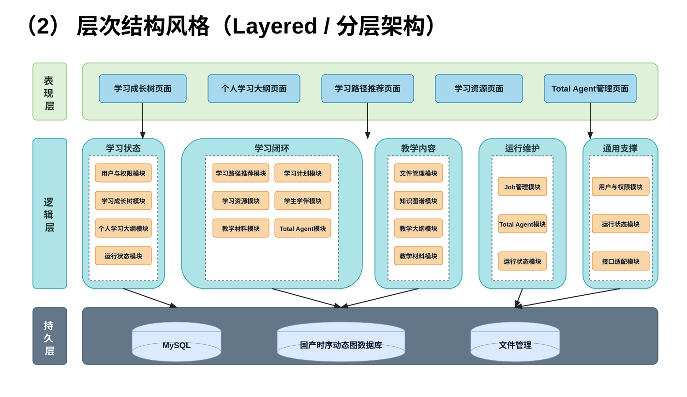
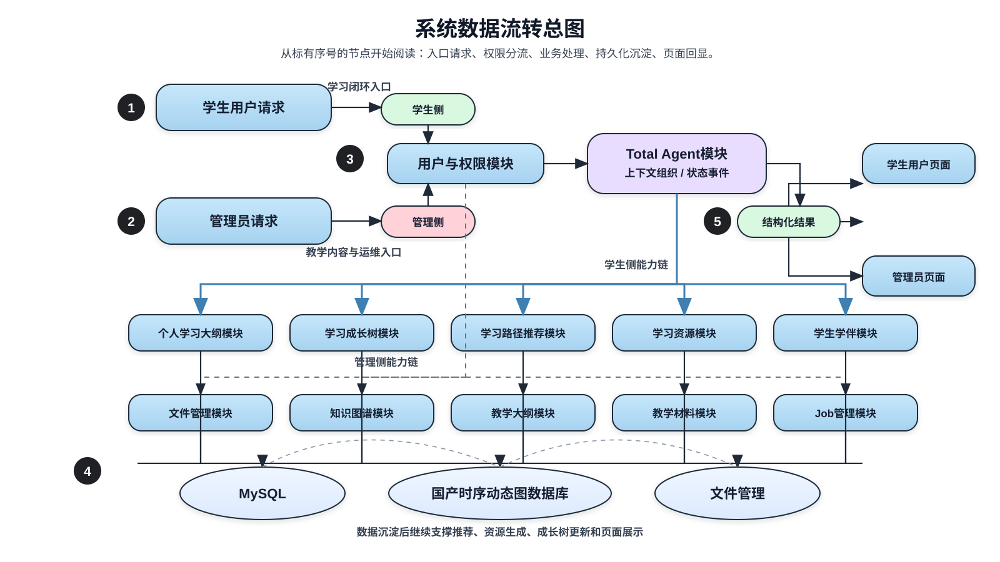

# 3 总体方案与系统架构

本章从总体处理流程、三层结构、多 Agent 协同、数据流转、系统边界和异常处理六个方面描述系统总体方案。系统以学生学习闭环和管理员教学内容运维为两条主线，保持表现层、逻辑层和持久层职责分离。

## 3.1 总体处理流程

### 3.1.1 学生用户学习闭环

学生用户侧围绕“查看状态、获得推荐、采纳路径、生成资源、查看资源、学伴交互”的路径运行。

| 阶段 | 处理内容 | 产出 |
| --- | --- | --- |
| 入口 | 学生用户登录并进入学习闭环 | 用户身份、课程上下文 |
| 状态读取 | 查看个人学习大纲和学习成长树；缺少数据时完成初始化或生成更新 | 个人学习大纲、学习成长树 |
| 路径生成 | 生成学习路径推荐，查看推荐列表和推荐详情 | 推荐路径、推荐详情 |
| 计划确认 | 学生用户采纳推荐路径，系统形成当前学习计划 | 当前学习计划、当前步骤 |
| 资源学习 | 根据当前计划生成学习资源，并支持资源列表和详情查看 | 学习资源、资源元数据 |
| 学伴交互 | 学生用户与自演化学生学伴交互 | 学伴回复、状态建议 |

该流程中，推荐详情只有在被学生用户采纳后才进入当前学习计划；学习资源生成不等同于学习完成；成长树更新应基于学习状态和真实触达数据。

### 3.1.2 管理员教学内容与运维流程

管理员侧围绕“教学文件、知识图谱、教学大纲、教学材料、后台任务、Total Agent 运行”的路径运行。

| 阶段 | 处理内容 | 产出 |
| --- | --- | --- |
| 入口 | 管理员登录并进入教学内容与运维工作区 | 管理员身份、权限上下文 |
| 文件与图谱 | 上传文件、查看下载文件、创建图谱、查看图谱列表 | 教学文件、知识图谱 |
| 大纲维护 | 上传日历生成大纲，管理教学大纲，查看大纲详情、列表和状态 | 教学大纲、生成状态 |
| 材料发布 | 发布教学材料草稿或终稿 | 教学材料、发布状态 |
| 任务运维 | 管理 Job，启动服务 JobChecker | Job 状态、运行结果 |
| Agent 运维 | 查看 Total Agent 定义，观察 totalAgent 同步和 SSE 运行 | Agent 定义、SSE 事件 |

管理员维护的教学大纲和教学材料在满足发布或可见状态后，供学生用户通过“查看大纲详情/列表/状态”和“查看材料详情/列表”访问。

## 3.2 总体结构设计

系统采用三层结构：表现层只包含前端展示页面名称；逻辑层只包含实际处理的功能模块名称；持久层只包含固定存储设施或存储对象名称。三层结构图见 [三层架构图](./assets/three_layer_architecture.svg)。

### 3.2.1 表现层

表现层由学生用户页面和管理员页面组成，只负责展示、输入和交互反馈，不承载业务处理逻辑。

| 分组 | 页面名称 |
| --- | --- |
| 学生用户页面 | 学习成长树页面、个人学习大纲页面、学习路径推荐页面、推荐详情页面、当前学习计划页面、学习资源页面、学生学伴页面、教学材料页面、教学大纲查看页面 |
| 管理员页面 | 文件管理页面、图谱管理页面、教学大纲管理页面、教学材料发布页面、Job管理页面、Total Agent 管理页面 |

### 3.2.2 逻辑层

逻辑层承接页面请求，完成鉴权、数据组织、状态变更、任务调度和 Agent 协同。

| 模块 | 负责功能 |
| --- | --- |
| 用户与权限模块 | 学生用户与管理员身份识别、角色权限校验 |
| 学习成长树模块 | 成长树查看、生成、更新、节点状态维护 |
| 个人学习大纲模块 | 个人大纲查看、初始化、课程上下文组织 |
| 学习路径推荐模块 | 推荐生成、推荐列表、推荐详情、推荐采纳 |
| 学习计划模块 | 当前计划查询、计划步骤状态维护 |
| 学习资源模块 | 学习资源生成、资源列表、资源详情 |
| 学生学伴模块 | 学伴对话、学习上下文组织、回复结果整理 |
| 文件管理模块 | 文件上传、文件列表、文件下载 |
| 知识图谱模块 | 图谱创建、图谱列表、图谱状态维护 |
| 教学大纲模块 | 教学大纲管理、日历生成大纲、大纲状态查询 |
| 教学材料模块 | 教学材料草稿、终稿发布、学生可见材料查询 |
| Job管理模块 | Job 查询、状态维护、JobChecker 启动 |
| Total Agent模块 | Agent 定义查看、同步运行、SSE 事件输出 |
| 运行状态模块 | 错误状态、运行事件、任务状态统一整理 |

### 3.2.3 持久层

持久层保存结构化数据、图谱数据、时序运行数据和文件对象，不承载业务处理逻辑。

| 存储名称 | 存储内容 |
| --- | --- |
| MySQL | 用户、课程大纲、个人大纲、推荐、学习计划、资源元数据、教学材料、Job 状态 |
| 国产时序动态图数据库 | 学习成长树、知识图谱、动态图节点边、运行状态序列 |
| 文件管理 | 上传文件、生成资源文件、教学材料附件、日历文件 |

## 3.3 多Agent协同结构

系统采用 Total Agent 统一编排专项能力的方式，避免页面直接理解复杂任务链。多 Agent 协同不改变“学生用户”和“管理员”两个参与者边界，Agent 是系统内部能力。

| Agent/能力 | 协同职责 | 输入 | 输出 |
| --- | --- | --- | --- |
| Total Agent | 统一识别意图、加载上下文、编排专项模块、整理结果和 SSE 事件 | 用户请求、页面上下文、运行配置 | 结构化结果、状态事件、错误信息 |
| 学习画像/大纲能力 | 支持个人学习大纲初始化和学习状态摘要 | 用户、课程、大纲、历史状态 | 个人学习大纲、学习状态摘要 |
| 路径推荐能力 | 生成推荐路径、列表和详情，支持采纳路径 | 个人大纲、成长树、课程内容 | 推荐路径、推荐详情、当前学习计划 |
| 资源生成能力 | 生成学习资源并写入资源对象 | 当前学习计划、课程内容、资源类型 | 学习资源、资源元数据 |
| 学生成长树能力 | 生成或更新学习成长树 | 学习状态、课程结构、学习行为 | 成长树节点边、掌握状态 |
| 学生学伴能力 | 面向学生用户组织对话和建议 | 学习上下文、资源、计划、成长树 | 学伴回复、下一步建议 |
| 运维任务能力 | 处理 Job、JobChecker、Total Agent 同步运行 | 管理员操作、任务状态、运行配置 | Job 状态、SSE 事件、同步结果 |

协同规则：

- Total Agent 负责内部编排，页面不直接串联多个后端模块。
- 推荐路径在被采纳前不写入当前学习计划。
- 学习资源生成不自动修改成长树掌握状态。
- 成长树生成或更新应保持学生用户和课程上下文一致。
- 管理侧生成的教学大纲、材料和图谱只通过发布或状态控制影响学生侧可见内容。
- SSE 事件用于展示运行状态，不替代最终业务结果。

## 3.4 数据流转设计

系统数据流转总图见 [系统数据流转总图](./assets/system_data_flow.svg)。

### 3.4.1 学生学习数据流

学生学习数据流从学生用户请求进入，经用户与权限模块校验后，由 Total Agent 模块组织学习上下文，并分发到个人学习大纲模块、学习成长树模块、学习路径推荐模块、学习资源模块和学生学伴模块。处理结果按数据类型沉淀到 MySQL、国产时序动态图数据库或文件管理中，再由运行状态模块整理状态，最终回显到学生用户页面。

关键数据流转：

| 数据 | 写入来源 | 读取去向 |
| --- | --- | --- |
| 个人学习大纲 | 个人学习大纲模块 | 学习路径推荐模块、学生学伴模块、个人学习大纲页面 |
| 学习成长树 | 学习成长树模块 | 学习路径推荐模块、学生学伴模块、学习成长树页面 |
| 推荐路径 | 学习路径推荐模块 | 推荐列表页面、推荐详情页面、采纳推荐路径 |
| 当前学习计划 | 学习路径推荐模块、学习计划模块 | 当前学习计划页面、学习资源模块、学生学伴模块 |
| 学习资源 | 学习资源模块 | 学习资源页面、学生学伴模块 |

### 3.4.2 管理教学内容数据流

管理教学内容数据流从管理员请求进入，经用户与权限模块校验后，进入文件管理模块、知识图谱模块、教学大纲模块、教学材料模块、Job 管理模块或 Total Agent 模块。文件对象进入文件管理，结构化业务状态进入 MySQL，图谱和动态状态进入国产时序动态图数据库，最终由运行状态模块汇总后回显到管理员页面。

关键数据流转：

| 数据 | 写入来源 | 读取去向 |
| --- | --- | --- |
| 教学文件 | 文件管理模块 | 文件管理页面、知识图谱模块、教学大纲模块 |
| 知识图谱 | 知识图谱模块 | 图谱管理页面、学习路径推荐模块 |
| 教学大纲 | 教学大纲模块 | 教学大纲管理页面、学生教学大纲查看页面、个人学习大纲模块 |
| 教学材料 | 教学材料模块 | 教学材料发布页面、学生教学材料页面 |
| Job 状态 | Job管理模块、JobChecker | Job管理页面、运行状态模块 |
| Total Agent 事件 | Total Agent模块 | Total Agent 管理页面、运行状态模块 |

## 3.5 系统边界

| 边界项 | 边界说明 |
| --- | --- |
| 参与者边界 | 系统只定义学生用户和管理员两个参与者。 |
| 学生数据边界 | 学生用户只能访问本人学习成长树、个人大纲、推荐、计划和可见资源。 |
| 管理数据边界 | 管理员维护教学内容和运维对象，不作为学生学习行为的直接执行者。 |
| 表现层边界 | 表现层只包含页面名称和展示职责，不包含业务处理描述。 |
| 逻辑层边界 | 逻辑层负责业务处理和模块协同，不直接保存文件对象或图谱底层数据。 |
| 持久层边界 | 持久层只保存 MySQL、国产时序动态图数据库、文件管理中的数据，不表达业务处理逻辑。 |
| 推荐边界 | 推荐路径未被采纳前不成为当前学习计划。 |
| 资源边界 | 资源生成不代表学习完成，不自动产生掌握状态。 |
| 发布边界 | 草稿材料和未发布大纲不得作为学生默认可见内容。 |
| 运行边界 | JobChecker 和 Total Agent SSE 运行需要明确状态，但不保证所有长任务同步完成。 |

## 3.6 错误与异常处理

### 3.6.1 异常类型

| 类型 | 示例 | 处理方式 |
| --- | --- | --- |
| 权限异常 | 未登录、角色不匹配、越权访问 | 拒绝请求并返回权限错误 |
| 数据缺失 | 无个人大纲、无成长树、无推荐、无当前计划 | 返回空状态，并提供可执行的下一步 |
| 状态冲突 | 推荐已过期、材料状态不一致、Job 已运行 | 返回冲突状态，避免重复写入 |
| 文件异常 | 上传失败、格式不支持、下载目标不存在 | 返回文件错误和失败原因 |
| 生成异常 | 大纲生成失败、图谱创建失败、资源生成失败 | 保存失败状态，允许重试或重新触发 |
| 运行异常 | JobChecker 启动失败、SSE 中断、Total Agent 同步失败 | 输出运行事件和错误信息 |
| 持久化异常 | 数据库写入失败、图谱写入失败、文件保存失败 | 回滚必要操作，保留可追踪错误 |

### 3.6.2 异常返回原则

- 所有失败结果应包含明确状态、错误信息和可定位上下文。
- 列表页面在局部数据失败时应优先展示可用数据和失败提示。
- 详情页面在目标对象不存在时应明确区分“不存在”“无权限”“未发布”“生成中”和“失败”。
- 生成类操作应记录任务状态，避免用户反复触发后无法判断结果。
- SSE 运行应包含开始、运行中、完成、失败或中断状态。
- 学生用户和管理员的错误信息应按角色过滤，不展示无关内部细节。
