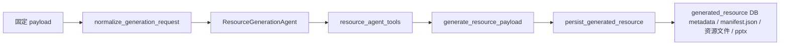

# 资源生成开发文档

本文档描述当前资源生成模块的最终实现边界。目标是说明输入输出契约、内部核心逻辑、测试构造和持久化内容，便于后续接入总 Agent、前端接口或继续扩展资源类型。

## 当前同步状态

资源生成模块当前承担“生成并持久化资源”的职责，不承担学习路径推荐、个人资源复用决策或即时答疑决策。Total Agent 会先在自身上下文中生成 `resource_strategy`，再调用 `generative_task.generate_resources_from_request`；资源模块只消费已经收口的 `resource_types`、`difficulty`、`knowledge_items`、`learning_goal`、`current_step` 和检索上下文。

当前默认链路是工具型 Resource Generation Agent：

```text
read_generation_request
-> read_generation_plan
-> retrieve_generation_materials
-> write_generation_draft
-> generate_resource_payload
-> persist_generated_resource
```

资源内容生成统一走 OpenAI-compatible / pydantic-ai 内容 Agent。旧 `LLMResourceGenerationAgent` 类名保留为兼容入口，但不再作为外部主控 Agent。当前真实支持的资源类型、落盘文件、校验字段和 detail 返回以 `tasks/generative/*` 实现为准，本 dev_doc 承载当前对外可依赖的实现边界；旧 small_plan / contract 只可作为历史参考。

`tool_status_events` 已从资源工具层透出，并由 Total Agent 汇总到最终结果；这可作为前端展示“读取请求 / 检索材料 / 写草稿 / 生成 payload / 持久化”的状态样本，但正式 streaming/SSE 协议仍应单独设计。

Total Agent 触发资源生成的统一 E2E 回归入口是：

```bash
RUN_LLM_TESTS=1 RUN_REAL_RAG_TESTS=1 RUN_DB_TESTS=1 python -m pytest -q tests/total_agent/test_total_agent_e2e.py -m "llm and search and mysql" --capture=tee-sys -rs
```

## 0. 新增的常量定义

路径常量位于 `constant.py`：

- `BasePath.GENERATIVE_ROOT = "/generative"`
- `BasePath.PERSONAL_SYLLABUS_ROOT = "/schedule/student_alt"`
- `BasePath.PERSONAL_PROFILE_ROOT = "/profiles"`

资源类型常量位于 `tasks/generative/contracts.py`：

- `GENERATIVE_RESOURCE_TYPES = ("documents", "mindmap", "quiz", "coding_practice", "ppt")`
- `MINDMAP_ALLOWED_DIAGRAM_PREFIXES = ("mindmap", "flowchart", "graph")`
- `GENERATIVE_MANIFEST_VERSION = "v1"`
- `GENERATIVE_MINDMAP_SCHEMA_VERSION = "v1"`
- `GENERATIVE_QUIZ_SCHEMA_VERSION = "v1"`
- `GENERATIVE_DOCUMENT_SCHEMA_VERSION = "v1"`
- `GENERATIVE_CODING_PRACTICE_SCHEMA_VERSION = "v1"`
- `GENERATIVE_PPT_SCHEMA_VERSION = "v1"`

当前真实资源类型能力：

| resource_type | 生成内容 | 落盘主文件 | detail render | 校验入口 |
|---|---|---|---|---|
| `documents` | 结构化短文档 | `document.json`、`document.md` | `markdown` | `validate_document_payload` |
| `mindmap` | Mermaid mindmap | `mindmap.json`、`mindmap.mmd` | `mermaid` | `validate_mermaid_text` |
| `quiz` | 诊断型题库 | `quiz.json`、`quiz.md` | `markdown` | `validate_quiz_payload` |
| `coding_practice` | 最小可运行代码实操 | `practice.json`、`practice.md`、代码文件 | `markdown` | `validate_coding_practice_payload` |
| `ppt` | 结构化课件 | `ppt.json`、`ppt.md`、`ppt.pptx` | `markdown` | `validate_ppt_payload` |

`coding_practice` 当前会把 `code_files` 写入资源目录下的安全相对路径，并在 `main_files.entry_file_path` 中记录入口文件；不提供真实沙箱执行。`quiz` 当前会生成可读 markdown，并在渲染层清理选项前缀，避免模型输出 `A. xxx` 时展示成 `A. A. xxx`。

持久化后端：

- `schemas/agent_runtime_state.py` 定义 `GeneratedResource` 和 `GeneratedResourceFile`。
- 生产读写必须依赖数据库 app context，并写入 `generated_resource` / `generated_resource_file` 数据库表。
- 资源实际文件仍写入 `/generative/user_{user_id}/...`，数据库只保存路径、metadata、validation 和 main files。
- 设置 `GENERATIVE_FILE_BACKEND=1` 或 `GENERATOR_FILE_BACKEND=1` 时使用文件 manifest；该模式仅用于测试和离线 artifacts，生产路径不做静默文件 fallback。

各类型真实 schema 摘要：

```text
documents
  content: schema_version, title, topic, summary, sections, extension_reading
  required: title, summary, non-empty sections
  section required: heading, body
  section optional list fields: key_points, examples, pitfalls, checklist, evidence
  validation summary: valid, method, schema_version, section_count, errors, warnings
  metadata: section_count, extension_count

mindmap
  content: title, topic, root, nodes, mermaid, knowledge_items, hierarchy
  required: non-empty mermaid
  validation: Mermaid text cleaned and checked against allowed prefixes
  validation summary: valid, method, diagram_type, node_count, errors, warnings
  metadata: knowledge_item_count

quiz
  content: schema_version, title, topic, questions
  required: title, non-empty questions
  question required: type, stem, answer, explanation
  supported question types: single_choice, judge, short_answer
  single_choice requires at least 2 options; judge answer must be boolean
  validation summary: valid, method, schema_version, question_count, errors, warnings
  metadata: question_count

coding_practice
  content: schema_version, title, topic, language, summary, learning_objectives, steps, code_files, run_guide
  required: title, topic, language, summary, non-empty steps, non-empty code_files, run_guide.entry_file, run_guide.command
  step required: title, instruction
  code_files required: safe relative path, non-empty content
  python validation: at least one .py file and AST syntax check
  run_guide entry_file must reference a code_files path; python command must run the entry file
  validation summary: valid, method=schema+python_syntax, schema_version, language, step_count, file_count, errors, warnings
  metadata: language, file_count, step_count, entry_file

ppt
  content: schema_version, title, topic, summary, theme, slide_style, slides
  required: title, topic, summary, non-empty slides
  slide required: title, body, non-empty bullets
  export: ppt.md + ppt.pptx
  validation summary: valid, method, schema_version, slide_count, errors, warnings
  metadata: slide_count, theme, slide_style
```

资源生成 agent 内部固定常量位于 `tasks/generative/resource_generation_agent.py`：

- `DEFAULT_RESOURCE_TYPES = ("documents", "mindmap", "quiz")`
- 资源内容生成统一通过 OpenAI-compatible/pydantic-ai 内容 Agent，不再暴露 LiteLLM model tier / model key 路由常量。

工具型资源 Agent 契约常量位于 `tasks/generative/resource_agent_contracts.py`：

- `RESOURCE_AGENT_SCHEMA_VERSION = "generative_agent.v1"`
- `RESOURCE_GENERATION_TOOL_ORDER = ("read_generation_request", "read_generation_plan", "retrieve_generation_materials", "write_generation_draft", "generate_resource_payload", "persist_generated_resource")`

资源模块已新增生产数据库 metadata 后端。资源正文、Markdown、PPTX、SVG 和代码文件仍由文件系统或后续对象存储承载；数据库保存资源索引、校验结果、metadata 和 main files 路径。测试或显式文件后端仍可使用 `/generative` manifest。

## 1. 影响的文件范围

核心实现：

- `blueprint/generative_api.py`
  - 资源生成 HTTP 入口。
  - 资源 list/detail HTTP 入口。
- `blueprint/syllabus_material_api.py`
  - 旧 `syllabus_material_*` URL 的兼容层。生成资源详情和列表已改为委托 `generative_task`；旧 `material_id` 草稿、更新、发布、状态、详情业务返回 `410 deprecated`。
  - 旧 `material` / `syllabusmaterials` 表、schema 和 repository 已清退；旧流程生成的材料和文件不再作为有效业务数据来源。
- `tasks/generative_task.py`
  - 模块间统一入口和兼容包装层。
  - 生成资源数据库/manifest 列表、分组和 detail 包装入口。
- `tasks/generative/resource_generation_agent.py`
  - 资源生成外层聚合、输入归一化和 OpenAI-compatible 内容 Agent。
  - 输入归一化。
  - 单资源生成。
  - 多资源聚合。
- `tasks/generative/resource_agent_contracts.py`
  - 工具型资源 Agent 的 schema、deps、输出模型和工具顺序常量。
- `tasks/generative/resource_agent_runtime.py`
  - pydantic-ai 资源生成 Agent 构造、工具注册和单资源 Agent 运行入口。
  - 模型构造统一走 `tasks.common.agent_model.build_openai_compatible_model`，兼容 DashScope Qwen/QwQ/DeepSeek thinking 模式与 tool calling 的参数限制。
- `tasks/generative/resource_agent_tools.py`
  - Agent 工具实现：读取请求、读取计划、检索材料、写草稿、生成资源 payload、持久化资源。
- `tasks/generative/resource_planning_agent.py`
  - 资源计划、检索、草稿 helper。
  - 由 `resource_agent_tools` 调用，不再作为完整资源生成 Agent 主控。
- `tasks/common/agent_model.py`
  - 统一构造 OpenAI-compatible pydantic-ai 模型。
  - 处理工具型 Agent 的供应商参数兼容。
- `tasks/generative/resource_persistence.py`
  - 落盘、校验、数据库 metadata / manifest 更新、`pptx` 导出。
- `tasks/generative/storage.py`
  - 路径、目录、归一化工具。
- `tasks/generative/contracts.py`
  - 资源类型契约和 schema version 常量。
- `tasks/generative/validation.py`
  - 各资源类型的本地校验。
- `tasks/generative/renderers.py`
  - `ppt` 渲染和导出。
- `tasks/generative/__init__.py`
  - 仅作为包说明，不作为外部业务入口。

测试：

- `tests/test_generative_resource_agent_integration.py`
- `tests/test_generative_task.py`
- `tests/test_generative_api.py`
- `tests/TEST_REPORT.md`

旧 `docs/generative_*_small_plan.md` / `docs/generative_*_contract.md` 不再作为当前实现依据；有效字段约束已经融合到本 dev_doc 和代码测试，不再维护平行契约。

## 2. 函数级收口的完整数据流

### 2.1 外部调用输入契约

外部调用方可以通过 API 或 task 函数触发资源生成。该层输入是业务请求输入，不是 Agent tool 直接消费的完整 state。

API 入口：

```text
POST /api/generative_generate
POST /api/generative_list
POST /api/generative_detail
POST /api/syllabus_material_list      # legacy URL, generated-resource list only when user_id is provided
POST /api/syllabus_material_detail    # legacy URL, generated-resource detail only when user_id/resource_id is provided
```

Task 入口：

```python
generate_resources_from_request(...)
run_resource_generation_agent(...)
generate_single_resource_from_request(...)
list_generated_resources(...)
list_generated_resources_by_type(...)
get_generated_resource_detail(...)
```

入口边界：

- `tasks/generative_task.py` 是资源生成和生成资源展示包装的唯一跨模块 task 门户。
- `tasks/generative/` 只放包内实现，外部 API 或其他 Agent 不应直接依赖包内函数。
- `tasks/material_task.py` 已废弃并删除；原先读取 manifest 并包装前端 detail 的能力迁入 `generative_task`。
- 旧教师产出习题 / material draft / material publish 业务已经停止维护，对应旧 URL 返回 `410 deprecated`。
- 旧 `material` 与 `syllabusmaterials` 表不再由后端模型注册，也不再参与文件列表、文件删除保护、资源展示或生成链路。真实 MySQL 可在确认无外部依赖后执行备份并 drop。

外部输入契约：

```json
{
  "user_id": 20,
  "question": "RowKey 如何避免热点？",
  "resource_types": ["documents", "mindmap", "quiz"],
  "syllabus_id": 29,
  "topic": "HBase RowKey 设计",
  "selected_weeks": [1, 2],
  "knowledge_items": ["RowKey", "热点", "预分区"],
  "weak_points": ["热点判断"],
  "learning_goal": "掌握 HBase RowKey 设计",
  "retrieval_context": {
    "graph_name": "RAG",
    "paragraphs": []
  },
  "generation_requirements": {
    "slide_count_target": 8
  }
}
```

字段说明：

- `user_id`：必填。用于资源目录隔离和落盘归属。
- `question`：必填。当前资源生成的主问题。
- `resource_types`：必填或默认。当前默认值为 `documents`、`mindmap`、`quiz`。
- `syllabus_id`：可选。提供后便于和课程上下文对齐。
- `topic`：可选。未提供时会从问题中派生。
- `selected_weeks`：可选。用于和课程周次对齐。
- `knowledge_items`：可选。作为资源结构化分支或要点来源。
- `weak_points`：可选。若未提供 `knowledge_items`，会回退到这里。
- `learning_goal`：可选。用于控制资源指向。
- `retrieval_context`：可选。只接受字典。
- `generation_requirements`：可选。模型层和版式约束只在这里收口。

### 2.2 Agent state 输入契约

`normalize_generation_request(...)` 会把外部输入整理成内部 state。真实资源生成 Agent 消费的是这个 state，而不是直接消费 API JSON。

state 核心字段：

```json
{
  "user_id": 20,
  "syllabus_id": 29,
  "question": "RowKey 如何避免热点？",
  "topic": "HBase RowKey 设计",
  "subject": "",
  "graph_name": "",
  "resource_types": ["documents", "mindmap", "quiz"],
  "selected_weeks": [1, 2],
  "knowledge_items": ["RowKey", "热点", "预分区"],
  "weak_points": ["热点判断"],
  "learning_goal": "掌握 HBase RowKey 设计",
  "profile_snapshot": {},
  "retrieval_context": {},
  "generation_requirements": {}
}
```

当前资源生成链路里，真正参与调度的 state 还会额外带上：

- `tool_trace`
- `planning_results`
- 单资源生成时的 `resource_type`
- `learning_brief`

### 2.3 资源编排 agent 的原子 tool

资源编排层的职责是把一次资源生成拆成可控的 plan、retrieval 和 draft 三段。当前原子工作已经拆清楚：

- `read_generation_plan`
- `write_generation_plan`
- `retrieve_generation_materials`
- `read_generation_draft`
- `write_generation_draft`

这些原子能力当前在 `tasks/generative/resource_planning_agent.py` 内部实现。后续如果改成更显式的 tool 注册形式，也应保持这五类能力不变。

### 2.4 构建路径：输入事件 -> 真实资源生成 Agent -> 资源 JSON -> 持久化

完整数据流：

```text
run_resource_generation_agent(payload)
  -> normalize_generation_request
  -> for each resource_type
      -> run_single_resource_generation_agent
          -> read_generation_request
          -> read_generation_plan
          -> retrieve_generation_materials
          -> write_generation_draft
              -> build learning_brief
          -> generate_resource_payload
              -> use compact planning bundle
          -> persist_generated_resource
  -> 聚合 success / failure / tool_trace
```

该链路中，pydantic-ai `ResourceGenerationAgent` 是默认主控。旧 `LLMResourceGenerationAgent` 仅保留为 `generate_resource_payload` 工具内部的兼容内容生成器，默认生产入口不直接把它当作 Agent 主控。

上下文压缩边界：

- `retrieve_generation_materials` 可以保留完整检索结果，供审计和 artifact 查看。
- `write_generation_draft` 会从 request、plan、retrieval_context、draft 中提炼 `learning_brief`。
- `generate_resource_payload` 不直接把完整 `retrieval_context.paragraphs` 送入模型，而是使用 compact planning bundle。
- `documents` 可保留较多证据摘要；`ppt`、`quiz`、`mindmap` 默认只保留短 evidence summaries 和 generation constraints，减少长链路 token 消耗。

对应的调用关系可以概括为：



模块输出契约：

```json
{
  "success": true,
  "request": "<normalized request>",
  "resources": ["<one result per resource type>"],
  "resource_count": 3,
  "success_count": 3,
  "failed_count": 0,
  "tool_trace": [
    "read_generation_request",
    "read_generation_plan",
    "retrieve_generation_materials",
    "write_generation_draft",
    "generate_resource_payload",
    "persist_generated_resource"
  ],
  "error_message": "",
  "error_code": ""
}
```

单资源输出契约由持久化层统一收口，核心字段如下：

- `success`
- `resource_id`
- `resource_type`
- `title`
- `topic`
- `status`
- `resource_dir`
- `validation`
- `metadata`
- `main_files`
- `planning_trace`
- `tool_trace`

数据库/manifest entry 和 detail 的稳定摘要字段由 `tasks/generative_task._resource_summary_from_entry` 统一包装：

```json
{
  "resource_id": "quiz-xxx",
  "resource_type": "quiz",
  "title": "HBase RowKey 热点诊断题",
  "topic": "HBase RowKey 设计",
  "syllabus_id": 29,
  "status": "ready",
  "resource_dir": "generative/user_19/quiz/quiz-xxx",
  "main_files": {
    "json_path": ".../quiz.json",
    "md_path": ".../quiz.md"
  },
  "validation": {
    "valid": true,
    "method": "local_schema"
  },
  "metadata": {},
  "created_at": 1780640000,
  "updated_at": 1780640000
}
```

`get_generated_resource_detail(user_id, resource_id)` 会读取 `main_files.json_path` 作为 `content`，并按主文件补充 `render`：

- 有 `md_path` 时返回 `render.markdown`。
- 有 `mermaid_path` 时返回 `render.mermaid`。
- `pptx_path` 和 `entry_file_path` 保留在 `main_files`，不直接内联文件正文。

## 3. 精确到输入输出的函数级收口

### 3.1 `normalize_generation_request(payload: dict) -> dict`

输入：

- 外部调用方传入的原始 payload。
- 允许兼容 `question` / `student_question`。
- 允许兼容 `resource_types` / `resource_type`。

输出：

- 归一化后的请求字典。
- 必含：`user_id`、`question`、`topic`、`resource_types`。
- 可选保留：`syllabus_id`、`subject`、`graph_name`、`selected_weeks`、`knowledge_items`、`weak_points`、`learning_goal`、`profile_snapshot`、`retrieval_context`、`generation_requirements`。

内部逻辑：

- 校验 `user_id` 必须为正整数。
- 校验 `question` 非空。
- 统一 `resource_types`，默认回退到 `DEFAULT_RESOURCE_TYPES`。
- 归一化 `syllabus_id`、`selected_weeks` 和字符串列表字段。
- 如果 `knowledge_items` 为空，则回退到 `weak_points`。
- 如果 `topic` 为空，则从 `question` 派生。

### 3.2 `build_single_resource_payload(request_payload: dict, resource_type: str) -> dict`

输入：

- 已归一化的请求字典。
- 单个资源类型。

输出：

- 带有 `resource_type` 的单资源请求字典。

内部逻辑：

- 统一资源类型名称。
- `mindmap` 资源若没有 `knowledge_items`，会用 `weak_points` 或 `topic` 补齐。
- 该函数只负责单资源请求拼装，不做生成和落盘。

### 3.3 `run_single_resource_generation_agent(request_payload: dict, resource_type: str, *, deps=None) -> ResourceGenerationAgentResult`

输入：

- 单资源请求 payload。
- 指定的资源类型。
- 可选 deps，包含 planning helper、payload generator、workspace root 和工具状态。

输出：

- `ResourceGenerationAgentResult`。
- 成功时带 `success=True`、`resource_type`、`resource`、`tool_trace`、`error_message`、`error_code`。

内部逻辑：

- 构造 pydantic-ai Agent，并注册六个资源生成工具。
- Agent 必须通过工具完成资源生成；最终 `resource` 以 `persist_generated_resource` 的返回为准。
- `write_generation_draft` 会生成 `learning_brief`，`generate_resource_payload` 使用 compact planning bundle 作为模型输入。
- 如果模型异常或工具链中断，从 deps state 中回填已生成的失败结果，保证外层聚合可以继续处理其他资源类型。

### 3.4 `generate_single_resource_from_request(request_payload: dict, resource_type: str, *, generation_agent=None, planning_agent=None) -> dict`

输入：

- 单资源请求 payload。
- 指定的资源类型。
- 可注入的兼容 generation agent 和 planning agent。

输出：

- 单个资源的持久化结果。
- 成功时带 `success=True`、`resource_id`、`resource_type`、`resource_dir`、`validation`、`main_files` 等字段。

内部逻辑：

- 默认情况下委托 `run_single_resource_generation_agent(...)`。
- 如果测试或旧调用方显式注入 `generation_agent`，则走兼容路径，便于 fake agent 和旧单元测试稳定运行。
- 将 planning trace 和 tool trace 透出给调用方。

### 3.5 `run_resource_generation_agent(request_payload: dict, *, generation_agent=None, planning_agent=None) -> dict`

输入：

- 外部固定 payload。
- 可注入的 generation agent 和 planning agent。

输出：

- 多资源聚合结果。
- 包含 `request`、`resources`、`resource_count`、`success_count`、`failed_count`、`tool_trace`、`error_message`、`error_code`。

内部逻辑：

- 先归一化请求。
- 按 `resource_types` 逐个调用 `run_single_resource_generation_agent(...)`。
- 每种资源独立执行完整工具链。
- 通过持久化工具生成最终文件和 manifest entry。
- 单个资源失败不会阻止其他资源继续生成。

### 3.6 `generate_resources_from_request(request_payload: dict, generation_agent=None, planning_agent=None) -> dict`

输入：

- 外部请求 payload。

输出：

- 等同于 `run_resource_generation_agent(...)` 的聚合结果。

内部逻辑：

- 作为兼容包装层，直接委托给 `run_resource_generation_agent(...)`。
- 该函数主要用于旧调用方和测试代码。

### 3.7 `LLMResourceGenerationAgent.generate_resource_content(request_payload: dict, resource_type: str, planning_bundle: dict) -> dict`

输入：

- 单资源请求。
- 资源类型。
- 规划 bundle。

输出：

- 对应资源的 typed JSON。

内部逻辑：

- `documents`、`mindmap`、`quiz`、`coding_practice`、`ppt` 各自走独立生成函数。
- 每类资源都会先调用 `_call_json(...)`，再做结构化归一化。
- 生成结果只负责内容，不负责文件写入。
- 当前仅作为 `generate_resource_payload` 工具内的兼容实现，默认外部入口不直接把它当作 Agent 主控。

## 4. 当前完成度

已完成：

- 最小生成 API。
- 结果 list/detail API。
- 资源生成 agent 主入口。
- 资源编排 agent 主入口。
- 统一文件持久化 tool。
- 固定 payload 的全流程测试。
- 旧 `generative_task` 回归测试保持通过。

当前全链路已验证资源类型：

- `documents`
- `mindmap`
- `quiz`
- `coding_practice`
- `ppt`

其中 `ppt` 当前会同时产出：

- `ppt.json`
- `ppt.md`
- `ppt.pptx`

当前 `pptx` 渲染不再是单一标题加纯 bullet 列表，而是会根据 slide 内容自动选择封面、双栏、步骤、总结和表格化内容布局。

## 5. 测试

当前测试文件：

- `tests/test_resource_planning_agent_integration.py`
- `tests/test_generative_api.py`
- `tests/test_generative_resource_agent_integration.py`
- `tests/test_generative_task.py`

测试意义：

- `test_resource_planning_agent_integration.py`
  - 验证资源编排 agent 自己层级的集成行为。
  - 验证 plan / retrieval / draft 的单轮与多轮行为。

- `test_generative_api.py`
  - 验证 HTTP API 能触发整条生成链。
  - 验证 generate / list / detail 三个口。

- `test_generative_resource_agent_integration.py`
  - 验证固定 payload 下的资源生成全流程。
  - 验证资源 Agent 的完整工具顺序。
  - 验证资源编排 helper 的 plan / retrieval / draft 原子步骤。
  - 验证部分失败时的聚合收口。
  - 真实 LLM + 真实 search opt-in 用例会按进度输出阶段 checkpoint，便于观察多资源长链路是否卡在某一类资源。

- `test_generative_task.py`
  - 验证各资源类型的文件写入、校验和 manifest 逻辑。

当前已验证结果（按仓库内最近回归记录）：

- 默认回归命令：

```bash
python -m pytest -q tests/test_generative_task.py tests/test_generative_api.py tests/test_generative_resource_agent_integration.py -m "not llm and not search"
```

最近一次默认回归结果：

```text
40 passed, 3 deselected
```

- 真实 LLM + 真实 search 功能验证命令：

```bash
PYTEST_DISABLE_PLUGIN_AUTOLOAD=1 RUN_LLM_TESTS=1 RUN_SEARCH_TESTS=1 SEARCH_TOOL_GRAPH_NAME=RAG python -m pytest -p no:debugging -q tests/test_generative_resource_agent_integration.py -m "llm and search" --capture=tee-sys -rs
```

主要产物：

```text
tests/artifacts/resources_generative_real_search_real_llm_generation_checkpoint.json
tests/artifacts/resources_generative_real_search_real_llm_all_resources_result.json
tests/artifacts/resources_generative_real_search_real_llm_all_resources_ppt.md
tests/artifacts/resources_generative_real_search_real_llm_workspace/
```

- 已通过真实 `curl` 请求验证 `ppt` 资源可生成 `ppt.pptx`

测试的文件落盘方式：

- 资源生成链测试会真实生成文件。
- 但都写入 `pytest` 提供的临时目录 `tmp_path`。
- 不写入项目正式 `generative/` 目录。
- 测试结束后这些临时文件不会作为正式结果保留。

这些测试主要验证 agent / tool / file system 这条链。新增 `tests/test_agent_runtime_db_persistence.py` 覆盖 Flask app context 下资源 metadata 写入数据库。

补充：

- 真实 `curl` 验证时会经过真实 Flask API、真实 search、真实 LLM 和真实 `python-pptx` 导出。
- 该链路需要可用的 MySQL、AbutionGraph、模型 API 网络以及 `lianjue` 环境。

## 6. 固定 payload 收口

当前资源生成总输入以固定 payload 为准，核心字段是：

- `user_id`
- `question`
- `resource_types`

可选增强字段：

- `syllabus_id`
- `topic`
- `selected_weeks`
- `knowledge_items`
- `weak_points`
- `learning_goal`
- `retrieval_context`
- `generation_requirements`：只表达资源结构约束，例如 `slide_count_target`、`quiz_count`、`theme`、`style`；不再表达模型路由。

这一层的原则是：

- 总 Agent 只传请求。
- 资源生成 agent 自己决定如何调用资源编排 agent。
- 资源编排 agent 只负责计划、检索和草稿，不负责最终持久化。
- 持久化层只负责文件写入和校验，不反向介入生成策略。

## 7. 后续建议

当前资源生成模块已经完成阶段性收口。后续如果继续演进，建议按以下顺序推进：

1. 把资源编排 agent 的 tool 调用形式继续显式化。
2. 再决定是否接审核 agent。
3. 扩展真实 LLM / 真实 search 集成测试中的资源质量审查维度。
4. 继续接总 Agent 和前端工具状态展示。

不建议当前阶段做的事：

- 让总 Agent 介入资源内部编排。
- 一次性接入路径 agent、审核 agent、前端新页面。
- 把资源生成链重新塞回旧学生端实验逻辑。

## 8. 文档事实源

`docs/resource_generation_dev_doc.md` 是资源生成模块唯一事实源。旧 `generative_*_small_plan.md` 和 `generative_*_contract.md` 的有效内容已经按真实代码实现融合进本文：

- 资源类型：`documents`、`mindmap`、`quiz`、`coding_practice`、`ppt`。
- 每类资源的 schema 摘要、校验入口、渲染入口、落盘文件和数据库/manifest detail 字段。
- 工具型 Resource Generation Agent 的输入归一化、计划/检索/草稿/payload/持久化链路。
- 旧静态资源阶段的文件系统边界、数据库 metadata 和 manifest 测试后端定位。

旧阶段文档可删除；如果后续发现旧文档仍有有效事实，应先融合进本文或测试，再删除旧文档。
