# 联觉 LianJue 学习平台 — 操作手册

> 配图路径：`openspec/changes/frontend-portal-redesign/mockups/`

---

## 目录

1. [登录与首页](#1-登录与首页)
2. [我的学习（Dashboard）](#2-我的学习dashboard)
3. [学科首页](#3-学科首页)
4. [教学大纲](#4-教学大纲)
5. [智能体（AI 学习助手）](#5-智能体ai-学习助手)
6. [学习成长图谱](#6-学习成长图谱)
7. [知识图谱（银河视图）](#7-知识图谱银河视图)
8. [我的测验](#8-我的测验)
9. [学伴小觉](#9-学伴小觉)
10. [管理后台](#10-管理后台)

---

## 1. 登录与首页

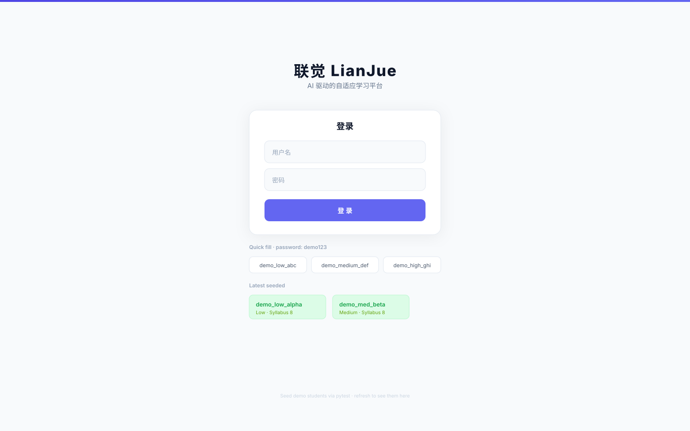

输入用户名和密码登录平台。登录成功后自动跳转到「我的学习」Dashboard。

---

## 2. 我的学习（Dashboard）

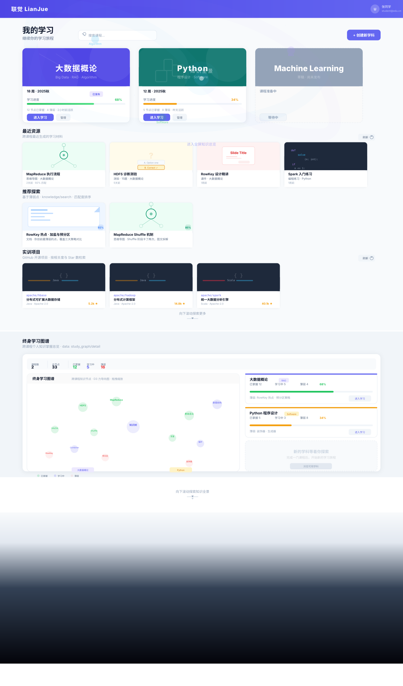

### 页面结构

| 区域 | 说明 |
|------|------|
| 顶栏 | Logo「联觉 LianJue」+ 用户头像 + 登出按钮 |
| 搜索框 | 搜索课程（280×36，圆角搜索框） |
| 课程卡片矩阵 | 已注册的学科，每张卡片显示学科名、进度条、薄弱点摘要 |
| 最近资源 | 跨课程最近生成的 4 份学习材料（文档/导图/测验/练习/PPT） |
| 推荐探索 | 基于薄弱点的知识搜索推荐（2 张卡片，含匹配度百分比） |
| GitHub 实训项目 | 相关开源项目推荐 |
| 终身学习图谱 | D3 力导向图谱，跨课程知识全景 |
| Galaxy 揭示 | 知识宇宙的全景星空视图 |

### 操作

- **进入课程**：点击课程卡片 → 进入学科首页
- **预览资源**：点击「最近资源」卡片 → 右侧滑出 ResourcePreviewDrawer 全屏预览
- **下载文件**：点击「推荐探索」PDF 卡片 → iframe 浏览器原生查看器页内预览

---

## 3. 学科首页

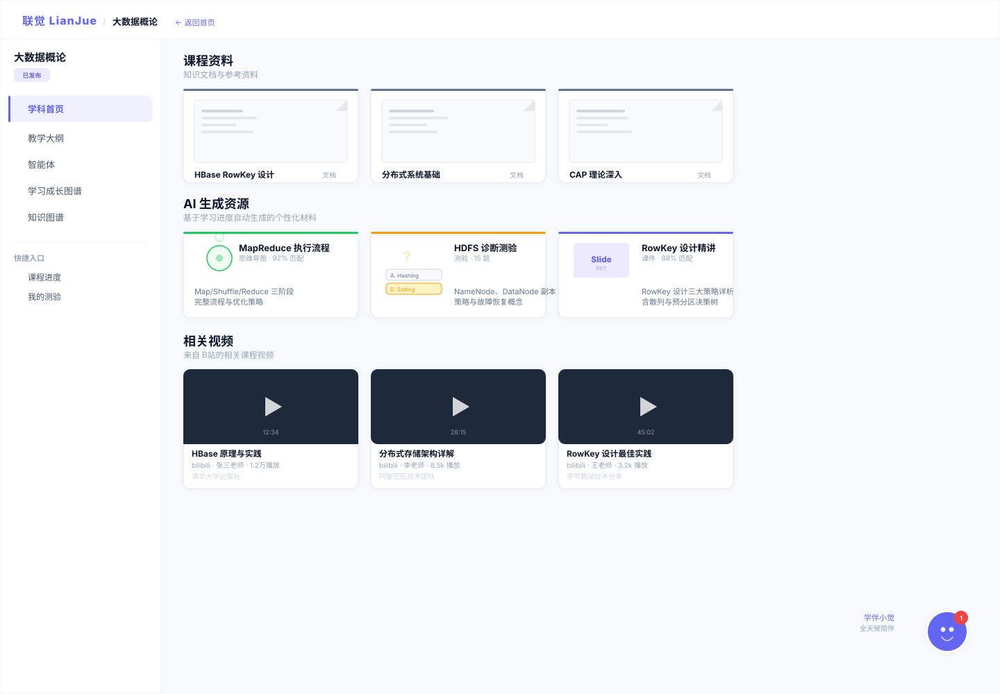

进入课程后，左侧为导航栏（232px），右侧为内容区。

### 左侧导航

| 导航项 | 说明 |
|--------|------|
| 学科首页 | 课程资料 + AI 生成资源 + 相关视频 |
| 教学大纲 | 逐周教学内容时间线 |
| 智能体 | AI 学习助手对话 |
| 学习成长图谱 | D3 知识图谱 + 学伴分析 |
| 知识图谱 | 暗色银河知识可视化 |
| 我的测验 | 测验列表与成绩 |

### 页面内容

| 区域 | 数据来源 | 交互 |
|------|---------|------|
| 课程资料（252×135 卡片） | `/api/file_list_graph_files` (graph-file) | 点击 PDF → FilePreviewModal iframe 预览；点击其他 → 下载 |
| AI 生成资源（252×124 卡片） | `/api/generative_list` | 点击 → ResourcePreviewDrawer 全屏预览（文档/导图/测验/练习/PPT） |
| 相关视频（252×172 卡片） | `/api/knowledge/video_search` (B站) | 点击 → 新标签打开 B站视频 |

---

## 4. 教学大纲

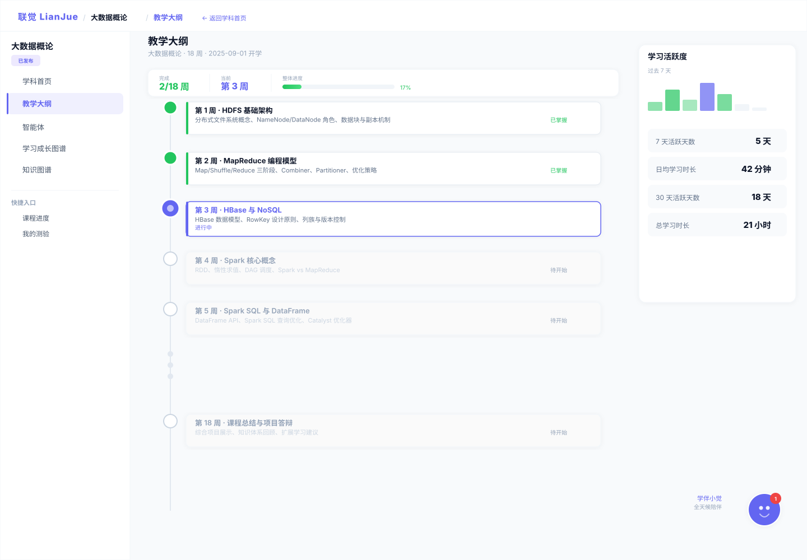

### 页面结构

| 区域 | 说明 |
|------|------|
| Stats Bar（840×48）| 完成周数 / 当前周 / 整体进度条 |
| 教学时间线（左栏）| 逐周内容卡片，显示 competence 状态（mastered/learning/weak） |
| 活跃度面板（右栏）| 学习活跃度甘特图 |

### 数据来源

- `POST /api/syllabus_detail` → 课程结构（period/week）
- `POST /api/learning_profile_detail` → 学习画像（competance 数据）

---

## 5. 智能体（AI 学习助手）

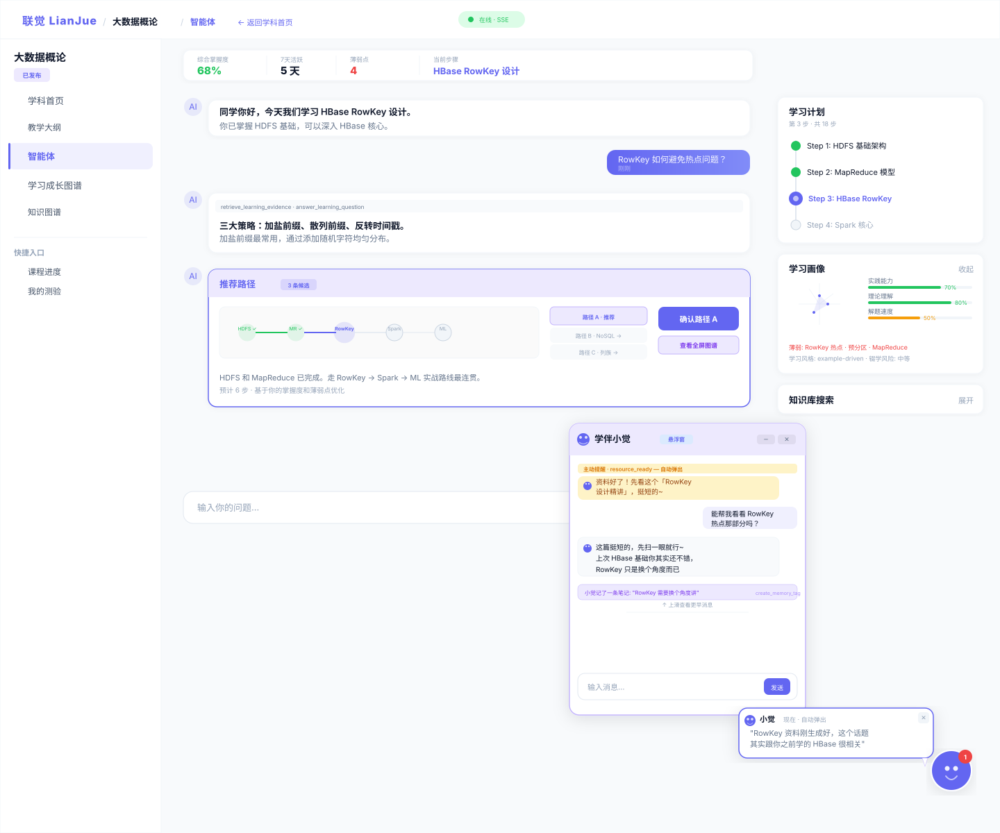

### 页面结构

| 区域 | 位置 | 说明 |
|------|------|------|
| Stats Bar（820×44）| 顶部 | 综合掌握度 / 7天活跃 / 薄弱点 / 当前步骤 |
| 聊天区（左） | flex-1 | SSE 流式对话 + 工具调用卡片 + 推荐路径卡片 |
| 右侧面板（296px） | 右侧 | 学习计划时间线 / 学习画像雷达图 / 知识库搜索 |

### 右侧面板功能

**学习计划卡片（296×210）**
- 时间线显示当前步骤（indigo 圆点）、已完成（绿色）、待完成（灰色）
- 数据来源：`useLearningPlan()` → `POST /api/syllabus_detail`

**学习画像卡片（296×172）**
- 折叠态：MiniRadar 60×60 五轴雷达图 + 技能条
- 展开态：ProfileRadarChart 全尺寸雷达图 + MetricCards（综合掌握/活跃/日均/风险）+ 学习特征标签 + 瓶颈知识点
- 数据来源：`useProfile()` → `POST /api/learning_profile_detail`

**知识库搜索卡片（296×42 → 展开）**
- RAG 增强检索：输入关键词 → 搜课程知识
- 搜索结果包含知识源文件（可下载）和生成资源（可预览）
- 关联图谱：D3 力导向图展示知识关联
- 数据来源：`GET /api/knowledge/search?q=&top_k=5`

### 聊天功能

| 功能 | 说明 |
|------|------|
| SSE 流式对话 | 实时打字机效果 |
| 工具调用卡片 | 展示 Agent 执行步骤（加载上下文 / 推荐路径 / 生成资源 等） |
| 推荐路径卡片 | 路径可视化 + 候选选择 + 确认 + 查看全屏图谱 |
| 资源卡片 | 生成完成后内联显示 ResourceCard（可展开预览） |

---

## 6. 学习成长图谱

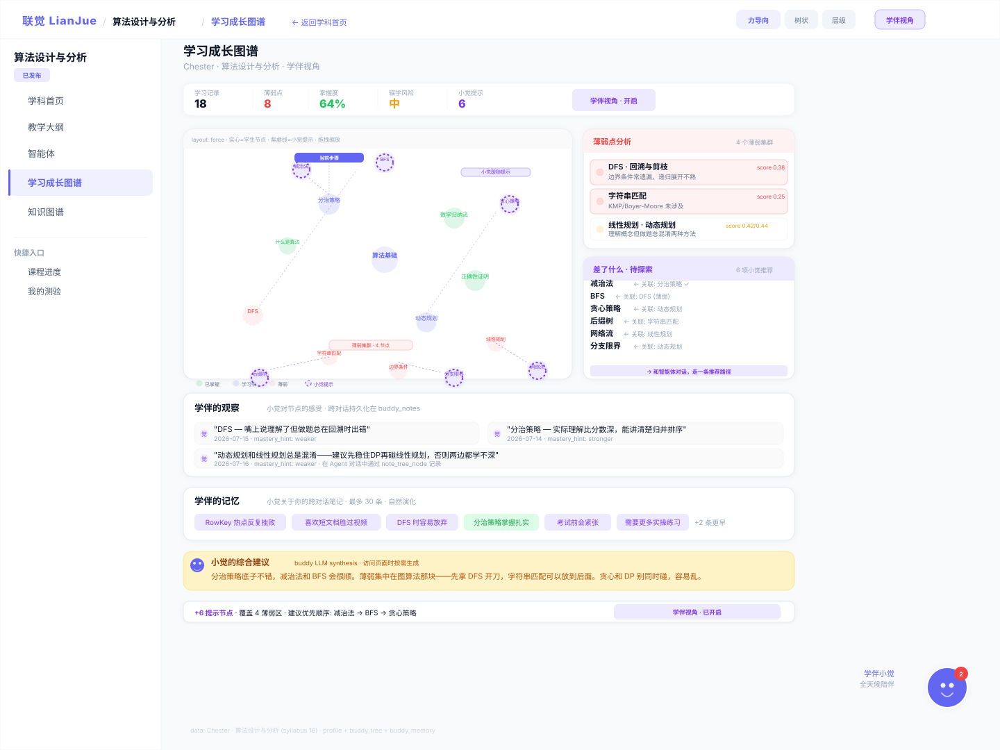

### 页面结构

| 区域 | 位置 | 说明 |
|------|------|------|
| Stats Bar（880×46）| 顶部 | 学习记录 / 薄弱点 / 掌握度 / 辍学风险 / 小觉提示 + 学伴视角 badge |
| D3 图谱（560×360）| 左 | 力导向知识图谱，节点颜色编码掌握状态 |
| 分析卡片（304px）| 右 | 薄弱点分析 + 待探索列表 + 学伴记忆 |
| 全宽区域 | 底部 | 学伴观察 + 小觉综合建议 + Gap Summary Bar |

### D3 节点颜色

| 颜色 | 含义 |
|------|------|
| 绿色实心 | 已掌握 |
| indigo 实心 | 学习中 |
| 红色虚线 | 薄弱点 |
| 紫色虚线 | 小觉提示（学伴推荐的探索节点） |
| indigo 粗边框 | 当前步骤 |

### 交互

- **点击 D3 节点** → 右侧滑出 NodeDetailPanel（标题/掌握度/生长阶段/图谱定位/和智能体讨论）
- **点击薄弱项** → NodeDetailPanel
- **点击待探索项** → NodeDetailPanel
- **点击学伴观察** → D3 图自动滚动并高亮对应节点
- **点击记忆标签** → 自动填入知识库搜索
- **拖拽缩放** D3 图

### 数据来源

| 数据 | API |
|------|-----|
| 学习图谱 | `GET /api/study_graph/detail` |
| 学伴树 | `GET /api/study_buddy/tree` |
| 学伴记忆 | `GET /api/study_buddy/memory` |
| 综合建议 | `GET /api/study_buddy/synthesis` |

---

## 7. 知识图谱（银河视图）

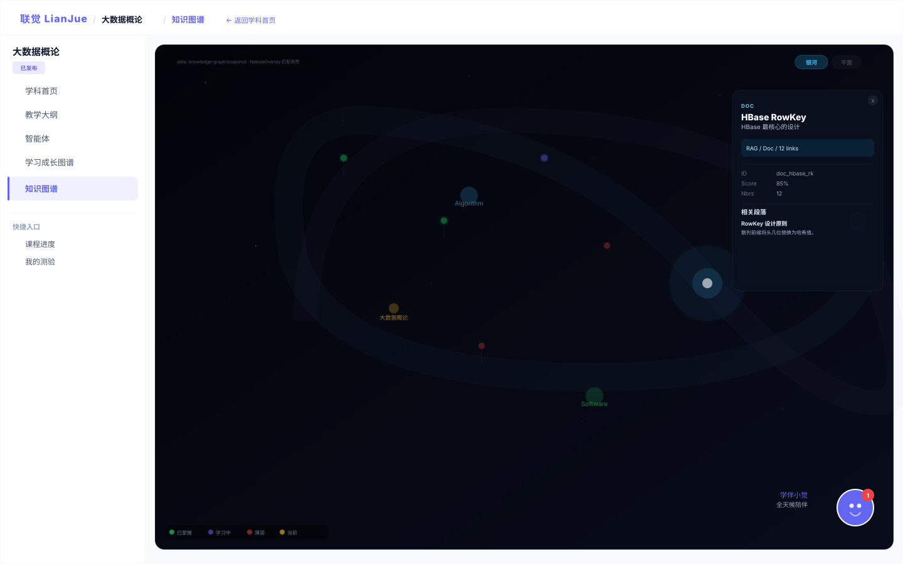

### 特点

- 暗色星空背景（深蓝渐变）+ 星场粒子
- 知识节点以星团形式分布
- 中央发光核心节点
- 底部信息栏：节点/边统计 + 图谱选择器

### 交互

- **点击节点** → 详情面板（kg-panel）：显示标题/类型/权重/邻居节点/关联段落
- **悬停节点** → 高亮关联边
- **星云叠加层**（NebulaOverlay）：学生掌握度数据覆盖
- **布局切换**

---

## 8. 我的测验

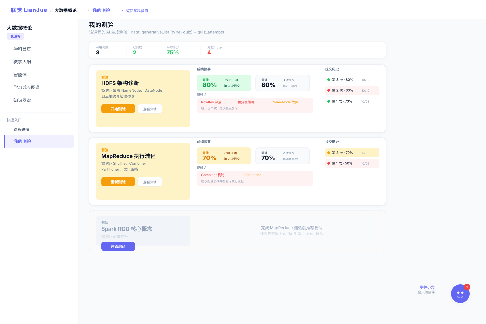

### 页面结构

| 区域 | 说明 |
|------|------|
| Stats Bar（880×48）| 可用测验数 / 已完成（绿色）/ 平均得分（绿色）/ 薄弱知识点（红色）|
| 已完成卡片（880×200）| 三栏布局：左 amber 测验标识 + 中 成绩摘要（最佳/最近/薄弱点）+ 右 提交历史 |
| 未答题卡片（880×120）| 虚线边框灰色卡片 + 题目信息 + 难度分布 |

### 测验流程

1. 点击「开始测验」→ 右侧滑出 ResourcePreviewDrawer
2. 逐题作答（选择 A/B/C/D）
3. 全部答完 → 点击「提交答案」
4. 显示结果 + 正确/错误标识
5. 可选「重新测验」重做 / 「反馈给 Agent」跳转到智能体分析

### 数据来源

| 数据 | API |
|------|-----|
| 测验列表 | `POST /api/generative_list` (type=quiz) |
| 答题记录 | `GET /api/quiz_attempts?user_id=&syllabus_id=` |
| 提交答题 | `POST /api/quiz_attempts` |
| 学习画像更新 | 提交后自动调用 profile update |

---

## 9. 学伴小觉

学伴「小觉」是 AI 学习伴侣，浮动在课程页面右下角。

### 组件

| 组件 | 说明 |
|------|------|
| BuddyFAB | 右下角圆形按钮（indigo 外圈 + 双眼 + 微笑弧）+ "学伴小觉 · 全天候陪伴" 文字 |
| BuddyPopupBubble | 新消息自动弹出（280×72 气泡，5 秒自动消失），点击打开浮动窗口 |
| BuddyFloatWindow | 340×420 浮动聊天窗口，紫色 header，消息类型（amber/gray/indigo）|

### 消息来源

- 学伴 API：`GET /api/study_buddy/messages?user_id=&syllabus_id=`
- 15 秒轮询检测新消息

---

## 10. 管理后台

管理系统入口：Dashboard 顶栏「+ 创建新学科」（仅 operator 权限可见）。

### 10.1 管理导航

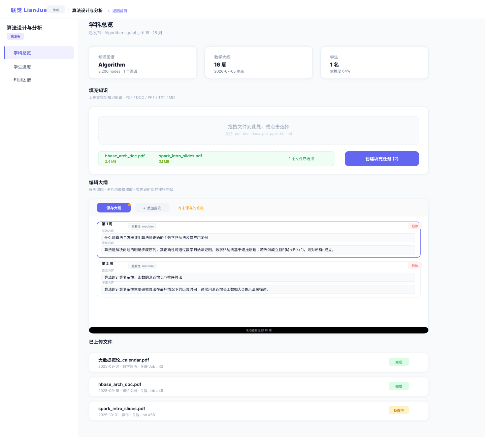

| 导航项 | 对应 SVG | 说明 |
|--------|---------|------|
| 学科总览 | 09-admin-dashboard | Stats 卡片 + 填充知识 + 编辑大纲 + 已上传文件 |
| 学生进度 | 11-admin-students | 学生全景卡片（学习图谱 vs 学伴树） |
| 知识图谱 | 12-admin-graph | 银河视图（复用学生端 KnowledgeGalaxyPage） |

### 10.2 学科总览功能

**Stats 卡片**
- 知识图谱 / 教学大纲 / 学生 三张统计卡片

**填充知识**


- 拖拽或点击选择文件（支持 .pdf/.doc/.docx/.ppt/.pptx/.txt/.md）
- 绿色已选文件列表 + 创建填充任务按钮
- 后端：上传文件 → 创建 Job → 知识提取管道

**编辑大纲**
- 逐周卡片编辑器
- 每张卡片：第 N 周 + 重要性（low/medium/high 下拉）+ 原始内容 textarea + 增强内容 textarea
- 工具栏：保存大纲 / + 添加周次 / 有未保存的修改
- 保存按钮仅在字段变化或周数变化时亮起（实时比较 savedPeriodRef）
- 删除周次按钮
- 数据来源：`POST /api/syllabus_detail` → `POST /api/syllabus_update`

**已上传文件**
- 来自 graph-file 系统（`POST /api/file_list_graph_files`）
- 合并 Job 状态（`GET /api/job_list?graph_id=`）
- 状态：完成（绿色）/ 失败（红色）/ 处理中（黄色）/ 未关联 Job（灰色）

### 10.3 创建新学科

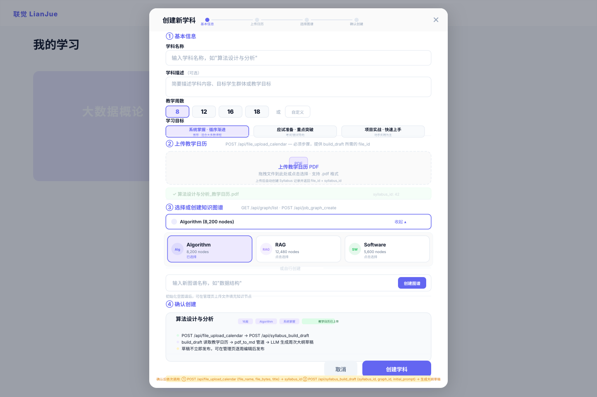

4 步向导式表单：基本信息 → 上传教学日历 → 选择图谱 → 确认创建。

### 10.4 学生进度

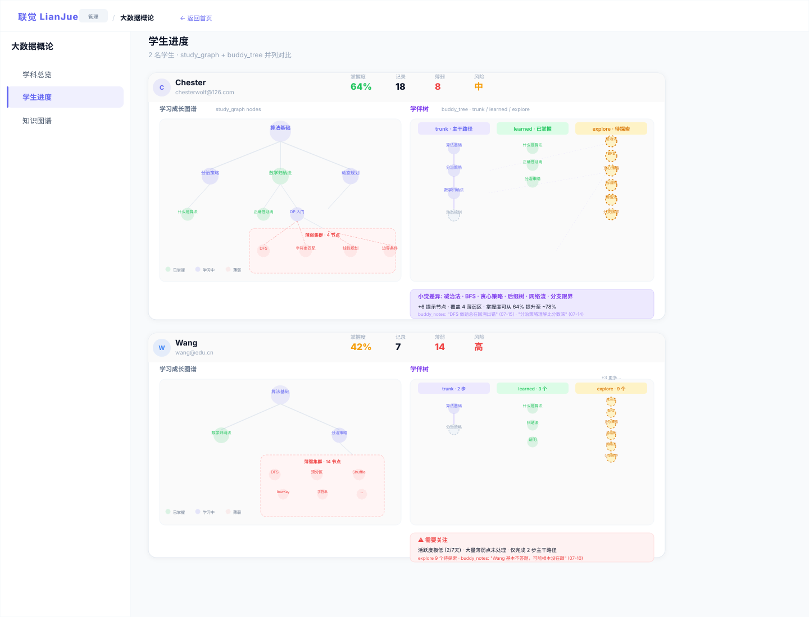

- 全景卡片（920×440）：学生姓名 + 邮箱 + 掌握度/记录/薄弱/风险 stats
- 双图并列：学习成长图谱（左）+ 学伴成长树（右）
- Profile 摘要 chips
- 数据来源：`GET /api/admin/syllabus/{id}/students_progress`

---

## 附录 A：数据流总览

```
用户端                          API                            后端服务
───────                        ───                            ──────
Dashboard      ──────────→  /api/syllabus_list              syllabus_repo
               ──────────→  /api/generative_list            generative_service
               ──────────→  /api/knowledge/search           RAG search
               ──────────→  /api/study_graph/detail         study_graph_task

SubjectHome    ──────────→  /api/file_list_graph_files      filegraph_repo
               ──────────→  /api/generative_list            generative_service
               ──────────→  /api/knowledge/video_search     B站 API

Agent          ──────────→  SSE /api/agent/chat             total_agent
               ──────────→  /api/recommendations            recommendation_task
               ──────────→  /api/knowledge/search           RAG search
               ──────────→  /api/learning_profile_detail    profile_task

LearningTree   ──────────→  /api/study_graph/detail         study_graph_task
               ──────────→  /api/study_buddy/tree           buddy_task
               ──────────→  /api/study_buddy/memory         buddy_task
               ──────────→  /api/study_buddy/synthesis      buddy_task

QuizAttempts   ──────────→  /api/generative_list            generative_service
               ──────────→  /api/quiz_attempts              quiz_attempts_task

Admin          ──────────→  /api/file_list_graph_files      filegraph_repo
               ──────────→  /api/job_list                   jobs_task
               ──────────→  /api/syllabus_update            syllabus_task
               ──────────→  /api/admin/.../students_progress admin_task
```

## 附录 B：文件预览体系

| 文件类型 | 预览方式 | 组件 |
|---------|---------|------|
| AI 生成文档 | ReactMarkdown 渲染 | ResourcePreviewDrawer |
| AI 生成导图 | Mermaid 库渲染 | ResourcePreviewDrawer |
| AI 生成测验 | 交互式答题 UI | ResourcePreviewDrawer |
| AI 生成练习 | 代码高亮 | ResourcePreviewDrawer |
| AI 生成 PPT | Slide 逐页 Markdown | ResourcePreviewDrawer |
| 原始 PDF | `<iframe>` 浏览器原生查看器 | FilePreviewModal |
| 原始 MD/TXT | `<pre>` 文本渲染 | FilePreviewModal |
| 原始 PPTX/ZIP | 直接下载 | — |
| B站视频 | `target="_blank"` 外链 | — |

## 附录 C：快捷键

| 快捷键 | 页面 | 说明 |
|--------|------|------|
| `G` | 图谱弹窗 | 切换图谱 |
| `Esc` | 图谱弹窗 | 关闭 |
| 滚轮 | D3 图 | 缩放 |
| 拖拽 | D3 图 | 平移 |
| `Enter` | 搜索框 | 触发搜索 |
